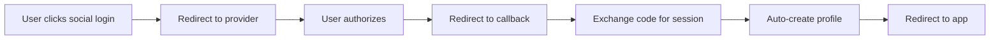

# 🚀 Hướng dẫn Setup Supabase cho Flight Booking App

## 📝 Tổng quan

Project này sử dụng **Supabase** làm backend database và authentication service. Supabase cung cấp:

- ✅ **PostgreSQL Database** với Real-time updates
- ✅ **Authentication** với social login (Google, Facebook, Apple)
- ✅ **Row Level Security (RLS)** để bảo mật data
- ✅ **Auto-generated APIs** với type-safe TypeScript
- ✅ **Storage** cho file uploads

## 🛠️ Setup Supabase Project

### 1. Tạo Supabase Project

1. Truy cập [supabase.com](https://supabase.com)
2. Đăng ký tài khoản miễn phí
3. Tạo project mới:
   - **Project Name**: `wego-flight-booking`
   - **Database Password**: Tạo password mạnh
   - **Region**: Singapore (gần Việt Nam nhất)

### 2. Setup Database Schema

1. Vào **SQL Editor** trong Supabase Dashboard
2. Copy và chạy file `supabase/schema.sql` để tạo database structure
3. Database sẽ tự động tạo:
   - **Tables**: profiles, airlines, airports, flights, bookings, search_history
   - **RLS Policies**: Bảo mật theo user
   - **Functions & Triggers**: Auto-update timestamps
   - **Sample Data**: Airlines và airports Việt Nam

### 3. Cấu hình Authentication

#### 3.1. Enable Social Providers

Vào **Authentication > Providers** và enable:

**🔹 Google OAuth:**
1. Vào [Google Cloud Console](https://console.cloud.google.com)
2. Tạo project mới hoặc chọn existing project
3. Enable Google+ API
4. Tạo OAuth 2.0 credentials:
   - **Application type**: Web application
   - **Authorized redirect URIs**: `https://[your-project-ref].supabase.co/auth/v1/callback`
5. Copy Client ID & Client Secret vào Supabase

**🔹 Facebook OAuth:**
1. Vào [Facebook Developers](https://developers.facebook.com)
2. Tạo app mới với **Consumer** type
3. Add **Facebook Login** product
4. Configure **Valid OAuth Redirect URIs**: `https://[your-project-ref].supabase.co/auth/v1/callback`
5. Copy App ID & App Secret vào Supabase

**🔹 Apple OAuth:**
1. Vào [Apple Developer](https://developer.apple.com)
2. Tạo **App ID** và **Services ID**
3. Configure **Sign In with Apple**
4. Add domain: `[your-project-ref].supabase.co`
5. Add redirect URL: `https://[your-project-ref].supabase.co/auth/v1/callback`
6. Copy Service ID & Private Key vào Supabase

#### 3.2. Configure Email Settings

Vào **Authentication > Settings**:
- **Site URL**: `http://localhost:3000` (development)
- **Redirect URLs**: Add production URL khi deploy

**🚨 QUAN TRỌNG - Cấu hình Production URLs:**

Khi deploy production, PHẢI cập nhật:

1. **Site URL**: `https://same-76ok83p7u6z-latest.netlify.app`
2. **Redirect URLs** thêm:
   - `https://same-76ok83p7u6z-latest.netlify.app/auth/callback`
   - `https://same-76ok83p7u6z-latest.netlify.app/**`

3. **Google OAuth Settings** trong [Google Cloud Console](https://console.cloud.google.com):
   - **Authorized redirect URIs** phải có:
     - `https://tyjemvlervqqefqrbwll.supabase.co/auth/v1/callback` (Supabase callback)
     - `https://same-76ok83p7u6z-latest.netlify.app/auth/callback` (App callback)

**⚠️ Lưu ý**: Nếu không cập nhật sẽ bị lỗi redirect về localhost:3000

### 4. Environment Variables

Copy `.env.example` thành `.env.local` và cập nhật:

```bash
# Lấy từ Settings > API
NEXT_PUBLIC_SUPABASE_URL=https://your-project-ref.supabase.co
NEXT_PUBLIC_SUPABASE_ANON_KEY=your-anon-key
SUPABASE_SERVICE_ROLE_KEY=your-service-role-key

# Your app URL
NEXT_PUBLIC_SITE_URL=http://localhost:3000
```

### 5. Test Authentication

1. Start development server: `bun dev`
2. Vào `/auth/login`
3. Test social login với Google/Facebook/Apple
4. Check **Authentication > Users** trong Supabase Dashboard

## 🔒 Security Features

### Row Level Security (RLS)

Database đã được setup với RLS policies:

- ✅ **Users chỉ xem được bookings của mình**
- ✅ **Public data** (airlines, airports, flights) cho tất cả
- ✅ **Profile data** được protect theo user ID
- ✅ **Search history** có thể anonymous hoặc user-specific

### Authentication Flow



## 📊 Database Schema

### Core Tables

```sql
-- User profiles (extends auth.users)
profiles (id, email, full_name, avatar_url, phone, ...)

-- Flight data
airlines (id, code, name, logo_url, country)
airports (id, code, name, city, country, coordinates)
flights (id, airline_id, flight_number, departure/arrival info, ...)

-- User data
bookings (id, user_id, flight_id, passenger_info, payment_status, ...)
search_history (id, user_id, search_params, ...)
```

### Relationships

- 👤 **Users** → **Profiles** (1:1)
- ✈️ **Airlines** → **Flights** (1:many)
- 🏢 **Airports** → **Flights** (departure/arrival)
- 👤 **Users** → **Bookings** (1:many)
- ✈️ **Flights** → **Bookings** (1:many)

## 🚀 Deployment

### Vercel/Netlify

1. Add environment variables trong deployment platform
2. Update **Site URL** và **Redirect URLs** trong Supabase
3. Deploy và test authentication

### Production URLs

Update Supabase settings với production URLs:
```
Site URL: https://your-domain.com
Redirect URLs:
- https://your-domain.com/auth/callback
- https://your-domain.com/**
```

## 🎯 Features Implemented

### ✅ Authentication
- [x] Social login (Google, Facebook, Apple)
- [x] Email/password login & registration
- [x] Auto-create profiles for social users
- [x] Protected routes với middleware
- [x] User menu với logout

### ✅ Database
- [x] Complete flight booking schema
- [x] Sample data cho Vietnamese airports/airlines
- [x] RLS security policies
- [x] Auto-update timestamps
- [x] Type-safe TypeScript interfaces

### 🔄 Next Steps
- [ ] User profile management page
- [ ] Flight search với real data
- [ ] Booking flow implementation
- [ ] Payment integration
- [ ] Email notifications
- [ ] Admin dashboard

## 🆘 Troubleshooting

### Common Issues

**❌ "Invalid redirect URL"**
- Check redirect URLs trong provider settings
- Ensure HTTPS trong production

**❌ "Row Level Security policy violation"**
- Check RLS policies trong Database
- Ensure user is authenticated

**❌ "Provider not configured"**
- Enable provider trong Authentication > Providers
- Add correct client credentials

**❌ "CORS error"**
- Check Site URL settings
- Add your domain to allowed origins

**❌ "OAuth redirect về localhost:3000"**
- Update Site URL trong Supabase Authentication settings
- Cập nhật Authorized redirect URIs trong Google Cloud Console
- Check file `.env.local` có đúng NEXT_PUBLIC_SITE_URL không
- Ensure tất cả OAuth providers có đúng production URLs

## 📚 Resources

- [Supabase Documentation](https://supabase.com/docs)
- [Next.js with Supabase](https://supabase.com/docs/guides/getting-started/quickstarts/nextjs)
- [Social Auth Setup](https://supabase.com/docs/guides/auth/social-login)
- [Row Level Security](https://supabase.com/docs/guides/auth/row-level-security)

---
💡 **Tip**: Sử dụng Supabase Dashboard để monitor users, database queries, và authentication logs trong real-time!
